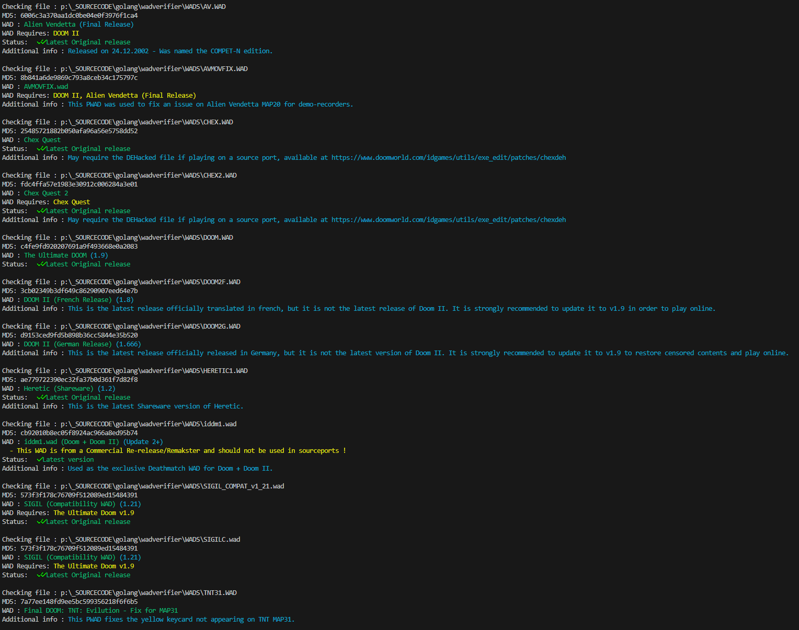

[](LICENSE)
[](https://github.com/ch0ww/wadverifier)
[](https://goreportcard.com/report/github.com/ch0ww/wadverifier)

[](https://patreon.baseq.fr)
[](https://ko-fi.com/P5P27UZHV)

# WADverifier

`WADverifier` is a small Command Line Interface tool written in Golang. It is used to quickly check if a DOOM-Engine based IWAD is valid or not, and up to date. 
Optionally, WADVerifier can also check through a json file to check the validity of some PWAD files. You can create your own json database if desired!

# Usage
```sh
wadverifier [-v] [-no-enter] [-resfile <filename.json>] <wad.wad[ wad2.wad ...]>
```

```
== Flags ==
-v : Be more verbose in case of warning messages
-no-enter : Removes the check to press ENTER at the end of the program

== Arguments ==
-resfile <filename>: opens a custom WAD resources file (.json format).
``` 

# Features
`WADverifier` currently supports these features :

### IWAD Identification
WADverifier can identify these IWADs:
* DOOM v1.0 up to 1.9
* The Ultimate Doom
* DOOM II v1.666 up to 1.9
* Final DOOM (Plutonia & TNT)
* Master levels of DooM II
* FreeDOOM v0.8 up to 0.13.0
* Heretic v1.0 up to 1.3
* Hexen v1.0 & v1.1 (+ Dark Citadel's Addon)
* Strife v1.0 up to 1.31 (+ Veteran Edition)
* HacX v1.0 up to 1.2
* Chex Quest 1, 2, and 3 (v1.0 & 1.4)
* SIGIL v1.0 up to 1.21 
* SIGIL II v1.0
* REKKR (v1.16 only, both PWAD or Standalone)
* DOOM 3 XBOX
* DOOM/DOOM2 XBLA
* DOOM 3 BFG (+ NERVE.WAD)
* DOOM 64 (NightDive Studios)
* DOOM & DOOM II - Unity versions
* DOOM & DOOM II - OdaKEX/KexDoom re-release (2024)
* And many many more !

### Latest version detection
WADverifier looks up if your IWAD is the latest version or not. If it's not, a message tells you what to do to get the latest version of your file !

### Drag & Drop (Windows only)
Windows users can directly drag their IWAD files to the WADverifier executable to quickly verify its validity!

### Color support
Because having a white-only text in a commandline application is not friendly enough, WADVerifier uses ANSI to color messages. All systems should support it without any issue.

### Custom declarations
WadVerifier support custom lists (in `.json` format), that can be useful to declare PWAD declarations. Check `pwaddata.json` for an example.

# Pre-Requisites for compilation
- Golang 1.17 or newer
- Package `color` from user Fatih (`go get github.com/fatih/color`)
- Package `go-ansi` from user k0kubun (`go get github.com/k0kubun/go-ansi`)

Then, inside the project folder, write `go build`.

# Screenshot


# Why are you using MD5 as a hash checking?
MD5 is the hash format that is checked by all known DOOM sourceports. We might support SHA-1 hashings in the near future after all...

# ToDo List
- [ ] Add support for GZDoom .pk3 IWADs (Action DooM / AD2:UB / Adventures of Square / W:BoA / Harmony / Blasphemer / ...)
- [ ] Get the earlier "Unity Doom" wad versions from the September 2020 update, and its subwads. (1.0 to 1.4)
- [ ] Probably a few code optimizations here and there.
- [ ] A small database of PWADs with revision changes could be nice.
- [ ] Support an online database that can be read upon launching the program.
- [ ] Get missing entries of many, many IWADs.

# Huge thanks to 
* Mike Swanson (Chungy) for adding several IWADs to the list !

# Licence
This program is licenced under GPLv3.
