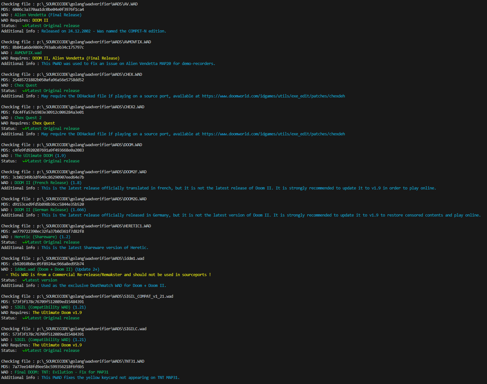

[](LICENSE)
[](https://github.com/ch0ww/wadverifier)
[](https://goreportcard.com/report/github.com/ch0ww/wadverifier)

[](https://patreon.baseq.fr)

# WADverifier

`WADverifier` is a small Command Line Interface tool written in Golang. It can quickly identify a DOOM engine-based IWAD, and verify if it is up to date. 
Optionally, WADVerifier can also load custom json files to check the validity of various files.

# Usage
```sh
wadverifier [-v] [-no-enter] [-resfile <filename.json>] <wad.wad[ wad2.wad ...]>
```

```
== Flags ==
-v : Be more verbose in case of warning messages
-no-enter : Removes the check to press ENTER at the end of the program

== Arguments ==
-resfile <filename>: opens a custom WAD resources file (in json format).
``` 

# Features

### IWAD Support

| Game | Versions supported | Notes |
| --- | --- | --- |
| DOOM | `v1.0 ➡ v1.9` | Also supports Shareware, re-releases & some Press-Releases |
| The Ultimate DOOM | `v1.9` | Also supports re-releases |
| DOOM II | `v1.666 ➡ 1.9` | Also supports re-releases & ports |
| Final DOOM | `v1.9` | Supports iD Anthology & re-releases |
| Master Levels for Doom II | `N/C` | Supports re-releases |
| FreeDOOM | `v0.8 ➡ 0.13.0` | Supports FreeDM and FreeDoom Phase 1 & 2 |
| Heretic | `v1.0 ➡ 1.3` | Supports Shareware & Betas |
| Hexen | `v1.0 ➡ 1.1` |  |
| Strife | `v1.0 ➡ 1.31` | |
| Strife: Veteran Edition | `v1.0 ➡ 1.2` |  |
| HacX | `v1.0 ➡ 1.2` |  |
| Chex Quest | `N/C` | Supports Chex Quest 1 & Chex Quest 2 |
| Chex Quest 3 | `v1.0, 1.4 & MODDB Release` |  |
| SIGIL | `v1.0 ➡ v1.23` | Also supports Buckethead's soundtrack. |
| SIGIL II | `v1.0` | [Need support for the THORR's soundtrack.](https://github.com/Ch0wW/wadverifier/issues/8) |
| REKKR | `v1.16` | Supports both the PWAD & Standalone release |
| No Rest For The Living | `v1.0` | |
| DOOM 64 | `v1.0 ➡ 1.1` | From NightDive Studios. |
| DOOM & DOOM II - Unity | `v1.0 ➡ v1.1 (incomplete)` | Doesn't support all releases yet. |
| DOOM & DOOM II - 2024 Re-Release | `v1.1 ➡ v1.2 (incomplete)` | From NightDive Studios - Not all versions are supported |
| Heretic + Hexen - 2025 Re-Release | `v1.0 (incomplete)` | From NightDive Studios - Not all versions are supported |

### Latest version detection
WADverifier checks what version you have against the latest known build. If outdated, a small guide to patch it is provided.

### Drag & Drop (Windows only)
Windows users can directly drag their IWAD files to the WADverifier executable to quickly verify its validity!

### Color support
WADVerifier uses ANSI to color messages as well as a few Emoji for readability. All systems should support it without any issue.

### Custom declarations
WADVerifier support custom lists (in `.json` format), if you want to check against your personal list of wads. Check `pwaddata.json` for an example.

# Pre-Requisites for compilation
- Golang 1.17 or newer
- Package `color` from user Fatih (`go get github.com/fatih/color`)
- Package `go-ansi` from user k0kubun (`go get github.com/k0kubun/go-ansi`)

Then, inside the project folder, write `go build`.

# Screenshot


# Why are you using MD5 as a hash checking?
MD5 is the hash format that has been used by every DOOM sourceport for a very long time, although SHA-1 is planned in the near future.

# ToDo List
- [ ] Add support for GZDoom .pk3 IWADs (Action DooM / AD2:UB / Adventures of Square / W:BoA / Harmony / Blasphemer / ...)
- [ ] Get the earlier "Unity Doom" wad versions from the September 2020 update and its wads. (1.0 to 1.4)
- [ ] Probably a few code optimizations here and there.
- [ ] A small database of PWADs with revision changes could be nice.
- [ ] Support an online database that can be read upon launching the program.
- [ ] Get missing entries of many, many IWADs.
- [ ] DOOM + DOOM II - Check for WAD omissions & Check updated files?
- [ ] Heretic + Hexen - Check for WAD omissions & Check updated files?

# Huge thanks to 
* Mike Swanson (Chungy) for adding several IWADs to the list !

# Licence
This program is licenced under GPLv3.
No AI is used for this project, nor is going to be ever used for a tool that needs exact values to verify data.